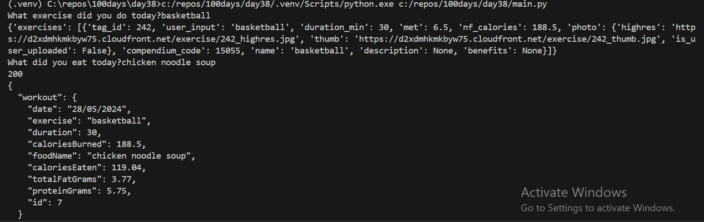
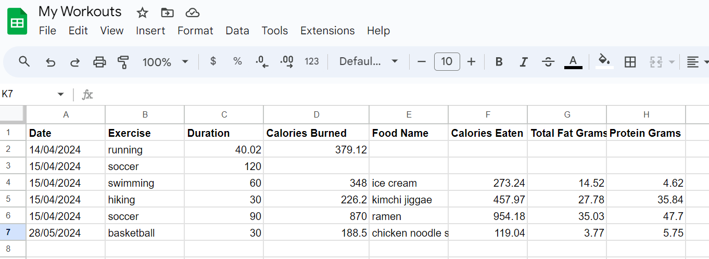

# Project

**Workouts** - Code to automate updating google sheets exercise workout log

## Description

After inputting an exercise and food in the command line, it fetches data from the NutritionIX API. Then it inputs it into a Google Sheet workout tracker as a new log, automatically calculating the estimated calories burned, calories eaten, and other nutritional data.

  

 

  

## Authors

Jacklyn Wong

## Version History

* 0.1
    * Initial Release - April 2024
